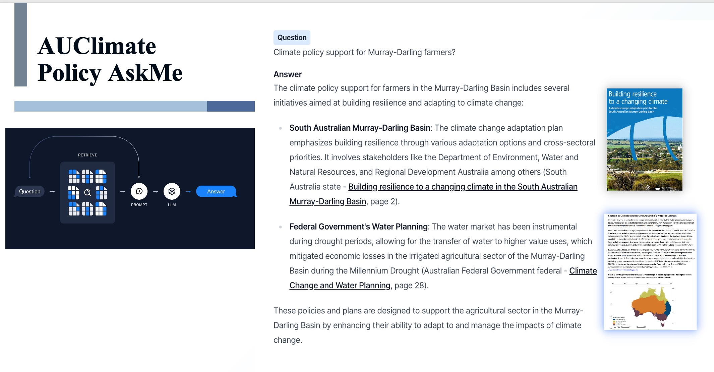
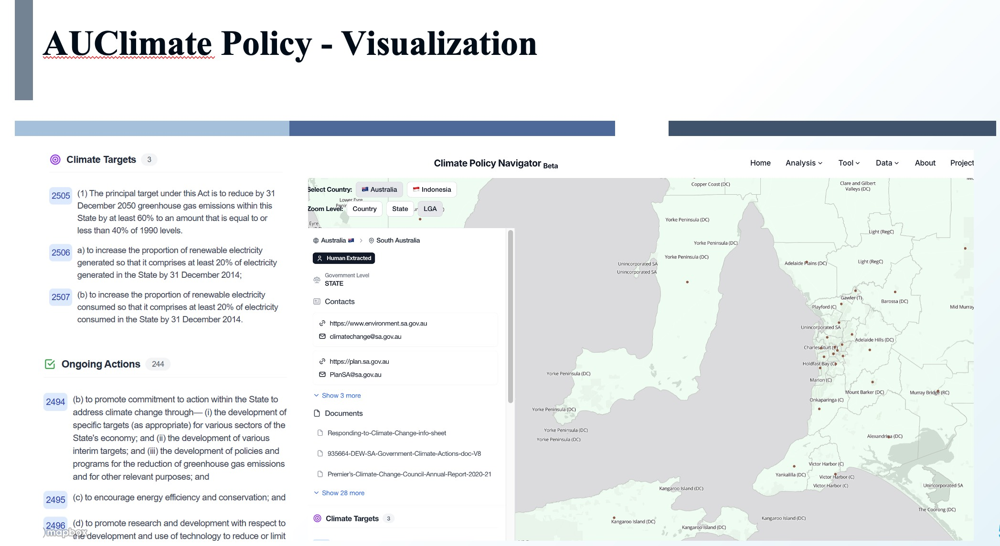
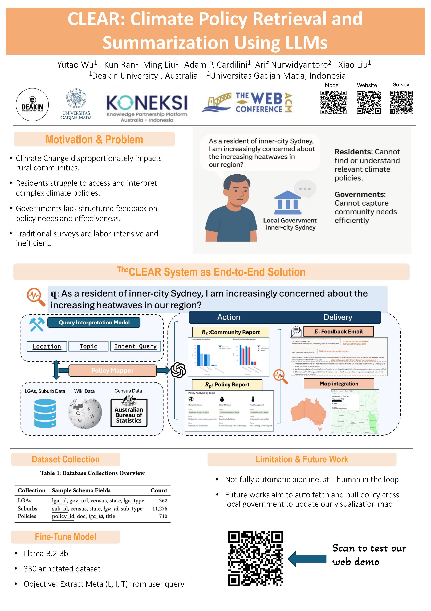
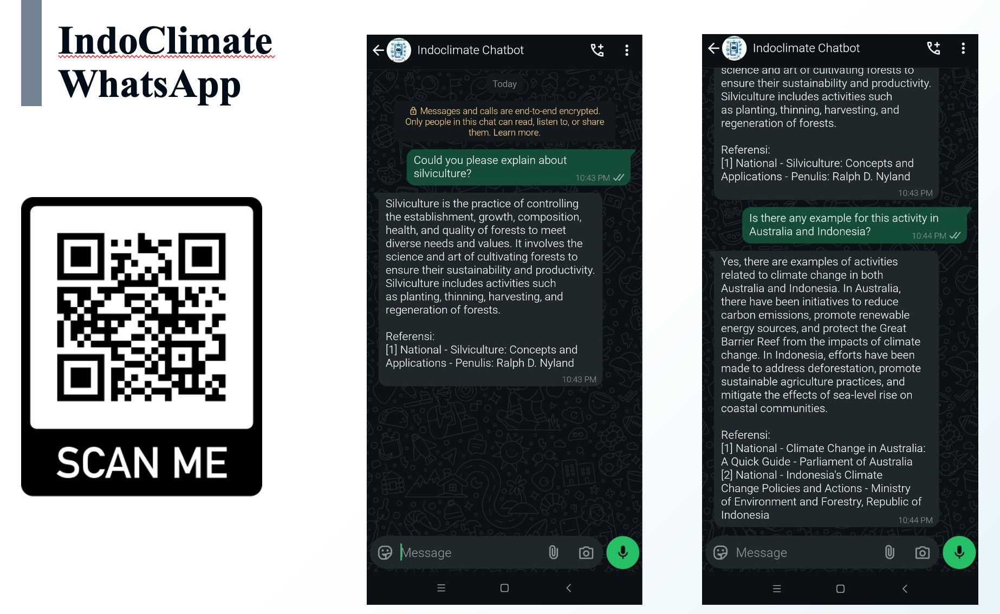
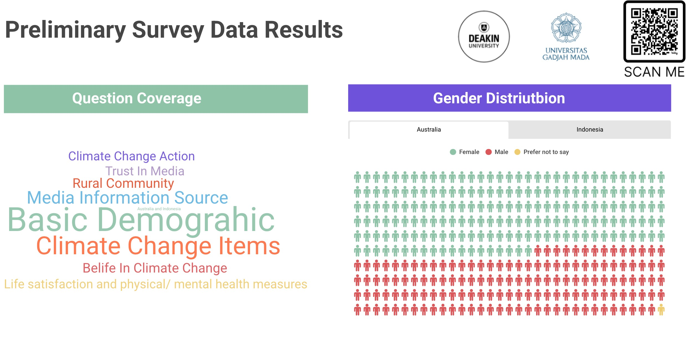

# 🌍 KONEKSI Collaboration Research Project
### *Climate Policy Navigator: Bridging Communities Through Digital Innovation*

<div align="center">

[](https://counterinfodemic.org)
[](https://youtu.be/d8kwXpryflY?si=ih5srYC-A1_Q7uCj)
[](https://dl.acm.org/doi/10.1145/3701716.3715170)
[]()

</div>

> 🚀 **A collaborative research initiative developing cutting-edge digital tools and analyzing media communication strategies for climate change policy dissemination in rural communities across Indonesia and Australia.**

**🌐 Explore Our Platform** → **[counterinfodemic.org](https://counterinfodemic.org)**

**🎥 Watch Platform Demo** → **[YouTube Showcase](https://youtu.be/d8kwXpryflY?si=ih5srYC-A1_Q7uCj)**

---

## 🎯 Mission Statement

<table>
<tr>
<td width="70%">

**Climate Policy Navigator** transforms complex climate policy information into accessible, interactive digital experiences. Our platform bridges the critical information gap between policymakers and rural communities in Indonesia and Australia through innovative AI-powered tools and comprehensive data visualization.

</td>
<td width="30%">

```
🌱 Sustainable Future
🤝 Community Engagement  
🔬 Evidence-Based Research
🌐 Digital Innovation
```

</td>
</tr>
</table>

---

## 🎯 Research Objectives

<div align="center">

| 🔍 **Investigate** | 🌉 **Develop** | 📊 **Analyze** |
|:---:|:---:|:---:|
| Effective communication strategies for climate policies in rural communities | Digital tools to bridge information gaps in vulnerable populations | Media patterns and information dissemination across regions |

</div>

### 🎯 Core Objectives

- 🔬 **Transparency**: Promoting open access to comprehensive climate policy information
- 🤝 **Collaboration**: Fostering joint efforts between government, academia, and communities  
- 💡 **Innovation**: Utilizing advanced AI technologies for better policy analysis
- 🌍 **Inclusivity**: Ensuring rural and regional community voices are heard
- 🌱 **Sustainability**: Supporting balanced environmental, economic, and social policies
- 📋 **Accountability**: Providing tools to track implementation and hold policymakers accountable

---

## 🛠️ Platform Features & Digital Tools

### 🌐 **Comprehensive Platform Access**
> **[🚀 Visit Climate Policy Navigator](https://counterinfodemic.org)** - *Your gateway to climate policy insights*

---

### 🇦🇺 **Australia Climate Policy Suite**

<details>
<summary><b>🤖 Interactive Ask Me System</b></summary>

Transform complex climate policies into accessible Q&A format for rural communities through our AI-powered chatbot.



**Features:**
- 💬 Natural language policy queries
- 🎯 Instant, accurate responses
- 📚 Comprehensive policy database
- 🔗 Source document linking

**🌐 Access Tool:** [Interactive Ask Me](https://counterinfodemic.org/tool/ask)

</details>

<details>
<summary><b>🗺️ Policy Visualization Platform</b></summary>

Interactive mapping tool for visualizing climate policies across Australian regions with advanced filtering and analysis capabilities.



**Features:**
- 🌏 Interactive global map interface
- 🎨 Color-coded policy intensity regions
- 🔍 Zoom from country to state/province level
- 📊 Detailed policy information pop-ups
- 📈 Real-time data updates

**🌐 Explore Platform:** [Policy Visualization](https://counterinfodemic.org/tool/ask)

</details>

<details>
<summary><b>⚡ CLEAR - AI-Powered Policy Summarization</b></summary>

**CLEAR** (Climate Legislation Enhanced Analysis & Retrieval) is our flagship innovation bridging information gaps through:



**🔬 Technical Innovation:**
- 🤖 **Query Analysis**: Fine-tuned Llama-3.2-3B model
- 📚 **Policy Retrieval**: Authoritative government document database  
- 🗺️ **Multi-modal Summarization**: Geospatial visualizations
- 🔄 **Automated Feedback**: Policy gap identification
- 📊 **Real-time Analytics**: Performance tracking

**📄 Research Publication:** [ACM Digital Library](https://dl.acm.org/doi/10.1145/3701716.3715170)

</details>

---

### 🇮🇩 **Indonesia Climate Communication Hub**

<details>
<summary><b>📱 WhatsApp Integration System</b></summary>

Leveraging Indonesia's most popular messaging platform to deliver climate information directly to rural communities.



**Features:**
- 💬 Native WhatsApp integration
- 🌐 Bahasa Indonesia support
- 📱 Mobile-first design
- 🤖 AI-powered responses
- 📍 Location-based policy information

**💬 Try WhatsApp Bot:** [Start Conversation](https://api.whatsapp.com/send/?phone=6289616373137&text&type=phone_number&app_absent=0)

</details>

---

## 📊 Comprehensive Data Analysis

### 🔍 **Analysis Dashboard**
> Analyze climate policy communication patterns through interactive visualizations and metrics tracking

**Available Analysis Tools:**
- 📈 **Survey Analysis**: Public perception and demographic insights
- 📺 **Communication Analysis**: Media channel effectiveness evaluation  
- 🗺️ **Geographic Analysis**: Regional policy implementation mapping
- 📊 **Trend Analysis**: Policy evolution and impact tracking

### 🗄️ **Policy Databases**

| 🇦🇺 **Australia Policy Database** | 🇮🇩 **Indonesia Policy Database** |
|:---:|:---:|
| Comprehensive Australian climate policies | Detailed Indonesian climate initiatives |
| Media coverage analysis | Communication approach analysis |
| Public response tracking | Community engagement metrics |
| **[Access AU Data](https://counterinfodemic.org/data)** | **[Access Indo Data](https://counterinfodemic.org/data)** |

---

## 📋 Research Methodology & Survey Results

### 📝 **Survey Design**
**Methodology:** Stratified online survey (by age, gender) via Online Research Unit (ORU) - **June 2024**

<div align="center">

### 📊 **Survey Metrics Overview**

| **Measure Categories** | **Details** |
|:---|:---|
| **👥 Demographics** | Age, region, gender, cultural background, education, income |
| **🏘️ Regional Context** | Rural area experience, extreme weather events |
| **💚 Health & Wellbeing** | Life satisfaction, physical/mental health indicators |
| **🌡️ Climate Perception** | Belief levels, importance, worry, knowledge assessment |
| **📋 Policy Awareness** | Government priorities, policy effectiveness, personal actions |
| **📺 Media Consumption** | Information sources, trust levels, media preferences |

</div>

---

### 🇦🇺 **Australia Survey Results**

<div align="center">

| **📊 Metric** | **📈 Value** |
|:---|:---|
| **👥 Sample Size** | **N = 1,234** (8.1% dropout • 22% screening) |
| **🎂 Age Demographics** | **18-93 years** (M = 56, SD = 17.32) |
| **⚧️ Gender Distribution** | Female: **688** (55.75%) • Male: **542** (43.92%) |
| **🌏 Cultural Diversity** | **26** Aboriginal Australian participants (2.10%) |
| **📍 Geographic Scope** | Rural/regional areas (ABS classification) |

</div>

---

### 🇮🇩 **Indonesia Survey Results**

<div align="center">

| **📊 Metric** | **📈 Value** |
|:---|:---|
| **👥 Sample Size** | **N = 1,048** (7.7% dropout • 34% screening) |
| **🎂 Age Demographics** | **18-78 years** (M = 30, SD = 9.16) |
| **⚧️ Gender Distribution** | Female: **501** (47.81%) • Male: **540** (51.53%) |
| **📍 Geographic Scope** | **100%** rural/regional participants |
| **🌐 Language Coverage** | Bahasa Indonesia primary |

</div>

---

### 📊 **Data Visualization Dashboard**



**🔗 Explore Interactive Results:** [Visit Analysis Dashboard](https://counterinfodemic.org/analysis)

---

## 🌟 Latest Platform Updates

### 📰 **Recent Developments**

<details>
<summary><b>🆕 AI-Powered Q&A System Launch</b></summary>

Our new AI-powered Q&A system provides instant, detailed responses to climate policy queries using cutting-edge natural language processing technology.

**Key Features:**
- ⚡ Real-time query processing
- 📚 Comprehensive policy database integration
- 🎯 Context-aware responses
- 📊 User interaction analytics

</details>

<details>
<summary><b>🗺️ Interactive Data Visualization Tool</b></summary>

Transform complex climate policy data into intuitive visual insights through our advanced charting and mapping interface.

**Capabilities:**
- 📈 Customizable parameter filtering
- 🎨 Dynamic chart generation
- 🌍 Geographic policy mapping
- 📊 Comparative analysis tools

</details>

<details>
<summary><b>🗄️ Comprehensive Policy Database</b></summary>

Joint database development between Deakin University and Universitas Gadjah Mada covering energy, transportation, agriculture, and environmental policies.

**Coverage:**
- 🏛️ Government policy documents
- 📋 Implementation tracking
- 🔍 Advanced search functionality
- 📊 Policy impact analysis

</details>

---

## 🤝 Partnerships & Collaboration

<div align="center">

### 🏛️ **Institutional Partners**

| **🎓 Academic** | **🏛️ Government** | **🌍 International** |
|:---:|:---:|:---:|
| Deakin University (Australia) | Australian Climate Agencies | KONEKSI Initiative |
| Universitas Gadjah Mada (Indonesia) | Indonesian Environmental Ministry | Regional Climate Networks |

</div>

---

## 🚀 Getting Started

### 🌐 **Quick Access Links**

<div align="center">

| **🛠️ Tool** | **📝 Description** | **🔗 Access** |
|:---|:---|:---:|
| **Climate Policy Navigator** | Main platform hub | [🌐 Launch](https://counterinfodemic.org) |
| **Interactive Ask Me** | AI-powered Q&A system | [💬 Chat](https://counterinfodemic.org/tool/ask) |
| **Policy Visualization** | Interactive mapping tool | [🗺️ Explore](https://counterinfodemic.org/tool/map) |
| **WhatsApp Bot (Indonesia)** | Mobile messaging integration | [📱 Connect](https://api.whatsapp.com/send/?phone=6289616373137) |
| **Analysis Dashboard** | Data insights and trends | [📊 Analyze](https://counterinfodemic.org/analysis) |

</div>

---

## 📈 Impact & Future Directions

### 🎯 **Current Impact**
- 🌍 **2,282** survey participants across two countries
- 💬 **Active** community engagement through multiple platforms
- 📚 **Comprehensive** policy database covering multiple sectors
- 🤖 **AI-powered** tools serving rural communities

### 🚀 **Future Roadmap**
- 🌐 Expansion to additional Southeast Asian countries
- 📱 Enhanced mobile applications
- 🤖 Advanced AI model development
- 🤝 Increased community partnership programs

---


## 🙏 Acknowledgments

<div align="center">

### 🎉 **Special Thanks**

**🏛️ Funding & Support**
- KONEKSI Collaborative Research Initiative
- Deakin University Research Grants
- Universitas Gadjah Mada Partnership

**👥 Research Excellence**
- Indonesia Research Team
- Australia Research Team  
- Community Partners & Participants


</div>

---

<div align="center">

**📄 Terms & Conditions** • **🔒 Privacy Policy** • **📊 Data Usage Guidelines**

*Built with ❤️ for climate action and community empowerment*

**🌱 Together, we're building a sustainable future through informed policy communication**

</div>


